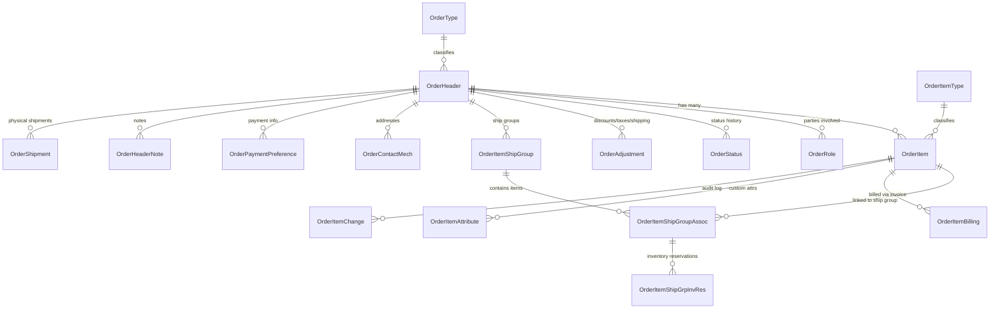
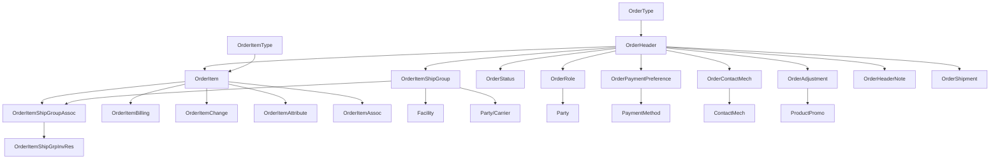
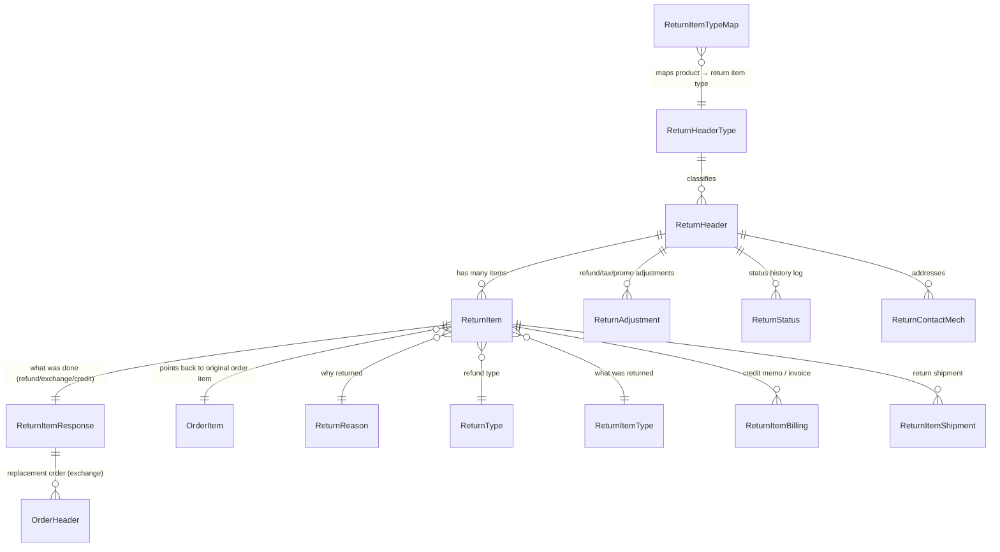
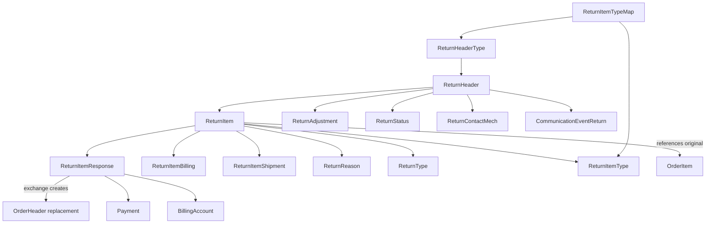

# OFBiz Order Data Model — Complete Entity Reference

> **Source**: `ofbiz-framework/applications/datamodel/entitydef/order-entitymodel.xml`  
> Aligned with: *OFBiz Data Model Book (2017)* + *Data Model Resource Book Vol.1*

---

## 📐 Big Picture: How Entities Fit Together



---

## 1. 🗂️ OrderType — *What kind of order is this?*

**PK**: `orderTypeId`

| Field | Type | Purpose |
|---|---|---|
| `orderTypeId` | id (PK) | e.g. `SALES_ORDER`, `PURCHASE_ORDER` |
| `parentTypeId` | id | For sub-types (self-referential hierarchy) |
| `hasTable` | indicator | Whether a detail table exists for this type |
| `description` | description | Human-readable label |

**Connects to**: `OrderHeader` (one OrderType → many OrderHeaders)

> **Key values in HotWax**: `SALES_ORDER` (Shopify orders), `PURCHASE_ORDER` (replenishment POs)

---

## 2. 📋 OrderHeader — *The master record of every order*

**PK**: `orderId`  
**Table**: `ORDER_HEADER`

This is **the top-level entity** — every order starts here. All other order entities point back to it.

| Field | Type | Purpose |
|---|---|---|
| `orderId` | id (PK) | Unique internal order ID (e.g. `ORD10001`) |
| `orderTypeId` | id (FK→OrderType) | `SALES_ORDER` or `PURCHASE_ORDER` |
| `orderName` | name | Human display name of the order |
| `externalId` | id | **Shopify order ID** — the external system's identifier |
| `salesChannelEnumId` | id | Sales channel (WEB, PHONE, POS, etc.) |
| `orderDate` | date-time | When customer placed the order |
| `entryDate` | date-time | When order entered the system |
| `statusId` | id (FK→StatusItem) | Current order-level status |
| `syncStatusId` | id | Sync status (e.g. `ORDER_CREATED` vs synced to 3PL) |
| `productStoreId` | id (FK→ProductStore) | The storefront/channel this order belongs to |
| `originFacilityId` | id (FK→Facility) | Warehouse/store of origin |
| `webSiteId` | id | Website that received the order |
| `currencyUom` | id | Currency code (USD, INR, etc.) |
| `billingAccountId` | id | Billing account for B2B orders |
| `grandTotal` | currency-amount | Total order value |
| `remainingSubTotal` | currency-amount | Amount still not yet invoiced |
| `priority` | indicator | Priority flag for inventory reservation |
| `isRushOrder` | indicator | Y/N rush order flag |
| `needsInventoryIssuance` | indicator | Whether inventory still needs to be issued |
| `invoicePerShipment` | indicator | Bill per shipment or per order? |
| `firstAttemptOrderId` | id | Points to original order if this is a retry |
| `autoOrderShoppingListId` | id | If auto-generated from a subscription list |
| `createdBy` | id-vlong | UserLogin who created the order |
| `isViewed` | indicator | Has this order been viewed in the OMS UI? |

**Key Relationships:**
- → `OrderType` (what type of order)
- → `ProductStore` (which store)
- → `Facility` (origin warehouse)
- → `StatusItem` (current status)
- ← `OrderItem` (has many line items)
- ← `OrderRole` (has many party roles)
- ← `OrderStatus` (status history log)
- ← `OrderAdjustment` (discounts, taxes, fees)
- ← `OrderItemShipGroup` (ship-to groups)
- ← `OrderContactMech` (order addresses)
- ← `OrderPaymentPreference` (payment info)

---

## 3. 📦 OrderItem — *Each line item in the order*

**PK**: (`orderId`, `orderItemSeqId`)  
**Table**: `ORDER_ITEM`

| Field | Type | Purpose |
|---|---|---|
| `orderId` | id (FK→OrderHeader) | Parent order |
| `orderItemSeqId` | id | Sequence within order (00001, 00002, …) |
| `externalId` | id | **Shopify line item ID** |
| `orderItemTypeId` | id (FK→OrderItemType) | e.g. `PRODUCT_ORDER_ITEM`, `DIGITAL_ORDER_ITEM` |
| `productId` | id (FK→Product) | The product being ordered |
| `supplierProductId` | id-long | Supplier's SKU reference |
| `quantity` | fixed-point | Units ordered |
| `cancelQuantity` | fixed-point | How many have been cancelled |
| `unitPrice` | currency-precise | Actual selling price per unit |
| `unitListPrice` | currency-precise | Original list price (before discount) |
| `unitAverageCost` | currency-amount | Cost of goods |
| `discountRate` | fixed-point | Discount % applied |
| `itemDescription` | description | Product name at time of order |
| `statusId` | id | Item-level status (ITEM_CREATED, ITEM_APPROVED, etc.) |
| `syncStatusId` | id | OMS sync status for this item |
| `estimatedShipDate` | date-time | When item expected to ship |
| `estimatedDeliveryDate` | date-time | When item expected to be delivered |
| `autoCancelDate` | date-time | Auto-cancel if not fulfilled by this date |
| `shipBeforeDate` / `shipAfterDate` | date-time | Shipping window constraints |
| `correspondingPoId` | id | Linked Purchase Order (for dropship/backorder) |
| `isPromo` | indicator | Whether item was added by a promotion |
| `comments` | comment | Internal notes on this item |
| `changeByUserLoginId` | id-vlong | Who last changed this item (audit) |
| `fromInventoryItemId` | id | Inventory item from which this was fulfilled |
| `overrideGlAccountId` | id | Override GL account for accounting |
| `quoteId` / `quoteItemSeqId` | id | If generated from a quote |
| `shoppingListId` | id | If from a saved shopping list |
| `subscriptionId` | id | If from a subscription |

**Key Relationships:**
- → `OrderHeader` (belongs to order)
- → `OrderItemType` (classification)
- → `Product` (what was ordered)
- → `StatusItem` (current status)
- ← `OrderItemShipGroupAssoc` (assigned to ship group)
- ← `OrderItemBilling` (invoiced via)
- ← `OrderItemAttribute` (custom key-value metadata)
- ← `OrderItemChange` (change audit log)
- ← `OrderItemShipGrpInvRes` (inventory reservation)

---

## 4. 🏷️ OrderItemType — *Classifying line items*

**PK**: `orderItemTypeId`

| Field | Type | Purpose |
|---|---|---|
| `orderItemTypeId` | id (PK) | e.g. `PRODUCT_ORDER_ITEM`, `RENTAL_ORDER_ITEM` |
| `parentTypeId` | id | Hierarchy support |
| `hasTable` | indicator | Extended table exists? |
| `description` | description | Human label |

> Common values: `PRODUCT_ORDER_ITEM`, `DIGITAL_ORDER_ITEM`, `BULK_ORDER_ITEM`

---

## 5. 👥 OrderRole — *Who is involved in this order?*

**PK**: (`orderId`, `partyId`, `roleTypeId`)  
**Table**: `ORDER_ROLE`

| Field | Type | Purpose |
|---|---|---|
| `orderId` | id (FK→OrderHeader) | The order |
| `partyId` | id (FK→Party) | The person or org |
| `roleTypeId` | id (FK→RoleType) | What role they play |

**Role Types in OMS:**
- `SHIP_TO_CUSTOMER` — the delivery recipient
- `BILL_TO_CUSTOMER` — who gets the invoice
- `PLACING_CUSTOMER` — who placed the order
- `END_USER_CUSTOMER` — actual end user
- `SUPPLIER_AGENT` — dropship vendor

> This is how the system knows **who** the customer is for each order.

---

## 6. 📊 OrderStatus — *Audit trail of every status change*

**PK**: `orderStatusId`  
**Table**: `ORDER_STATUS`

| Field | Type | Purpose |
|---|---|---|
| `orderStatusId` | id (PK) | Auto-generated unique ID |
| `statusId` | id (FK→StatusItem) | What status was set |
| `orderId` | id (FK→OrderHeader) | The order |
| `orderItemSeqId` | id | Optional: applies to specific item |
| `orderPaymentPreferenceId` | id | Optional: applies to payment pref |
| `statusDatetime` | date-time | When the status changed |
| `statusUserLogin` | id-vlong | Who triggered the change |
| `changeReason` | description | Why the status changed |

> This is an **append-only log**. Every status transition (Approved → Processing → Complete) is a new row here.

**Order Status Lifecycle:**

```
ORDER_CREATED → ORDER_APPROVED → ORDER_PROCESSING → ORDER_COMPLETED
                                                  → ORDER_CANCELLED
                                                  → ORDER_REJECTED
```

**Item Status Lifecycle:**
```
ITEM_CREATED → ITEM_APPROVED → ITEM_BACKORDERED → ITEM_PICKED → ITEM_PACKED → ITEM_COMPLETED
                             → ITEM_CANCELLED
```

---

## 7. 💸 OrderAdjustment — *Discounts, Taxes, Shipping Charges*

**PK**: `orderAdjustmentId`  
**Table**: `ORDER_ADJUSTMENT`

| Field | Type | Purpose |
|---|---|---|
| `orderAdjustmentId` | id (PK) | Unique ID |
| `orderAdjustmentTypeId` | id (FK→OrderAdjustmentType) | `PROMOTION_ADJUSTMENT`, `SHIPPING_CHARGES`, `SALES_TAX`, etc. |
| `orderId` | id (FK→OrderHeader) | The order |
| `orderItemSeqId` | id | If item-level adj (null = order-level) |
| `shipGroupSeqId` | id | If ship-group-level adj |
| `amount` | currency-precise | The adjustment value (+positive, -negative for discounts) |
| `recurringAmount` | currency-precise | For subscriptions |
| `amountAlreadyIncluded` | currency-precise | VAT/GST already baked into price |
| `sourcePercentage` | fixed-point | Discount/tax % |
| `productPromoId` | id | If from a promotion rule |
| `description` | description | Human description |
| `includeInTax` | indicator | Is this adjustment taxable? |
| `includeInShipping` | indicator | Does tax apply to shipping? |
| `isManual` | indicator | Manually applied (not automated rule) |
| `taxAuthGeoId` | id | Tax jurisdiction (Geo) |
| `taxAuthPartyId` | id | Tax authority party |
| `exemptAmount` | currency-amount | Tax exemption amount |
| `overrideGlAccountId` | id | Override GL account |
| `originalAdjustmentId` | id | Points to parent adj (e.g., tax on shipping → links to shipping adj) |

**Adjustment Types:**
| Type ID | Meaning |
|---|---|
| `PROMOTION_ADJUSTMENT` | Discount from promo code or rule |
| `SHIPPING_CHARGES` | Shipping fees charged to customer |
| `SALES_TAX` | Tax line |
| `DISCOUNT_ADJUSTMENT` | Manual/line-item discount |
| `VAT_TAX` | VAT tax (included in price) |
| `FEE` | Additional fees |

---

## 8. 🚚 OrderItemShipGroup — *A shipping package/group from this order*

**PK**: (`orderId`, `shipGroupSeqId`)  
**Table**: `ORDER_ITEM_SHIP_GROUP`

One order may ship from **multiple locations** or **to multiple addresses** — each scenario is a separate ship group.

| Field | Type | Purpose |
|---|---|---|
| `orderId` | id (FK→OrderHeader) | The order |
| `shipGroupSeqId` | id | Group sequence (00001, 00002, …) |
| `shipmentMethodTypeId` | id | Shipping method (UPS_GROUND, FEDEX_2DAY, etc.) |
| `carrierPartyId` | id (FK→Party) | The carrier company |
| `carrierRoleTypeId` | id | Carrier's role type |
| `facilityId` | id (FK→Facility) | **Which warehouse/store will fulfill** |
| `contactMechId` | id (FK→ContactMech) | Ship-to postal address |
| `telecomContactMechId` | id | Ship-to phone number |
| `supplierPartyId` | id | If dropship: which supplier |
| `vendorPartyId` | id | For multi-vendor: which vendor |
| `trackingNumber` | short-varchar | Carrier tracking number |
| `shippingInstructions` | long-varchar | Special delivery notes |
| `maySplit` | indicator | Can this group be split into multiple shipments? |
| `isGift` | indicator | Gift shipment? |
| `giftMessage` | long-varchar | Gift note |
| `shipAfterDate` | date-time | Don't ship before this date |
| `shipByDate` | date-time | Must ship by this date (SLA) |
| `estimatedShipDate` | date-time | Expected ship date |
| `estimatedDeliveryDate` | date-time | Expected delivery date |

> **In HotWax context**: The `facilityId` here is set by the brokering engine — it represents the fulfillment location assigned to fulfill these items.

---

## 9. 🔗 OrderItemShipGroupAssoc — *Which items go in which ship group?*

**PK**: (`orderId`, `orderItemSeqId`, `shipGroupSeqId`)  
**Table**: `ORDER_ITEM_SHIP_GROUP_ASSOC`

This is the **many-to-many bridge** between `OrderItem` and `OrderItemShipGroup`.

| Field | Type | Purpose |
|---|---|---|
| `orderId` | id | The order |
| `orderItemSeqId` | id | The item |
| `shipGroupSeqId` | id | The ship group |
| `quantity` | fixed-point | How many units of this item are in this ship group |
| `cancelQuantity` | fixed-point | How many were cancelled from this group |

> An item may appear in **multiple ship groups** (partial ship), with quantity split.

---

## 10. 🏦 OrderPaymentPreference — *How is the order being paid?*

**PK**: `orderPaymentPreferenceId`  
**Table**: `ORDER_PAYMENT_PREFERENCE`

| Field | Type | Purpose |
|---|---|---|
| `orderPaymentPreferenceId` | id (PK) | Unique ID |
| `orderId` | id (FK→OrderHeader) | The order |
| `paymentMethodTypeId` | id | `CREDIT_CARD`, `EXT_SHOPIFY`, `GIFT_CARD`, `EFT_ACCOUNT` |
| `paymentMethodId` | id | Specific saved payment method |
| `finAccountId` | id | Financial account (store credit, gift certificate) |
| `maxAmount` | currency-amount | Max amount to charge against this method |
| `statusId` | id | `PAYMENT_NOT_RECEIVED`, `PAYMENT_AUTHORIZED`, `PAYMENT_RECEIVED`, `PAYMENT_CANCELLED` |
| `billingPostalCode` | short-varchar | Billing ZIP for AVS |
| `manualAuthCode` | short-varchar | Manual authorization code |
| `securityCode` | long-varchar (encrypted) | CVV — **should not persist beyond a transaction** |
| `presentFlag` | indicator | Card present (POS) transaction? |
| `processAttempt` | numeric | How many times payment was attempted |
| `needsNsfRetry` | indicator | Failed due to NSF, needs retry |
| `createdDate` | date-time | When preference was created |

---

## 11. 📍 OrderContactMech — *Addresses associated with the order*

**PK**: (`orderId`, `contactMechPurposeTypeId`, `contactMechId`)  
**Table**: `ORDER_CONTACT_MECH`

| Field | Type | Purpose |
|---|---|---|
| `orderId` | id (FK→OrderHeader) | The order |
| `contactMechPurposeTypeId` | id | `SHIPPING_LOCATION`, `BILLING_LOCATION`, `GENERAL_LOCATION` |
| `contactMechId` | id (FK→ContactMech) | The actual address or contact record |

> `ContactMech` → `PostalAddress` for physical addresses, `TelecomNumber` for phone.

---

## 12. 📦 OrderShipment — *Links an order item to a physical shipment*

**PK**: (`orderId`, `orderItemSeqId`, `shipGroupSeqId`, `shipmentId`, `shipmentItemSeqId`)

| Field | Type | Purpose |
|---|---|---|
| `orderId` | id | The order |
| `orderItemSeqId` | id | The order item |
| `shipGroupSeqId` | id | The ship group |
| `shipmentId` | id (FK→Shipment) | The physical shipment record |
| `shipmentItemSeqId` | id | The item within the shipment |
| `quantity` | fixed-point | Units shipped |

> This is the **bridge between OMS and the shipment/fulfillment system**.

---

## 13. 🧾 OrderItemBilling — *Links order items to invoices*

**PK**: (`orderId`, `orderItemSeqId`, `invoiceId`, `invoiceItemSeqId`)

| Field | Type | Purpose |
|---|---|---|
| `orderId`, `orderItemSeqId` | id | The order item |
| `invoiceId`, `invoiceItemSeqId` | id | The invoice line |
| `itemIssuanceId` | id | Item issuance from warehouse |
| `shipmentReceiptId` | id | Shipment receipt (for POs) |
| `quantity` | fixed-point | Billed quantity |
| `amount` | currency-amount | Billed amount |

---

## 14. 📝 OrderItemChange — *Audit log of item mutations*

**PK**: `orderItemChangeId`

| Field | Type | Purpose |
|---|---|---|
| `orderItemChangeId` | id (PK) | Unique log entry |
| `orderId`, `orderItemSeqId` | id | Which item |
| `changeTypeEnumId` | id | `ODR_ITM_QTY` (qty change), `ODR_ITM_PRICE`, `ODR_ITM_STATUS` |
| `changeDatetime` | date-time | When the change happened |
| `changeUserLogin` | id-vlong | Who made the change |
| `quantity` | fixed-point | New quantity |
| `cancelQuantity` | fixed-point | New cancel quantity |
| `unitPrice` | currency-amount | New price |
| `reasonEnumId` | id | Reason code |
| `changeComments` | comment | Free-text explanation |

---

## 15. 🎯 OrderItemShipGrpInvRes — *Inventory Reservations*

**PK**: (`orderId`, `shipGroupSeqId`, `orderItemSeqId`, `inventoryItemId`)

| Field | Type | Purpose |
|---|---|---|
| `orderId`, `shipGroupSeqId`, `orderItemSeqId` | id | The order item + ship group |
| `inventoryItemId` | id (FK→InventoryItem) | Specific inventory unit reserved |
| `quantity` | fixed-point | Reserved quantity |
| `quantityNotAvailable` | fixed-point | Quantity that could NOT be reserved (backorder qty) |
| `reservedDatetime` | date-time | When reservation was made |
| `promisedDatetime` | date-time | When fulfillment is promised |
| `currentPromisedDate` | date-time | Updated promised date |
| `priority` | indicator | High/low priority |
| `sequenceId` | numeric | Reservation order |

---

## 16. 🏷️ OrderAttribute — *Custom key-value data on an order*

**PK**: (`orderId`, `attrName`)

| Field | Type | Purpose |
|---|---|---|
| `orderId` | id (FK→OrderHeader) | The order |
| `attrName` | id-long | Attribute key (e.g. `SHOPIFY_TAGS`, `CUSTOMER_NOTES`) |
| `attrValue` | value | Attribute value |
| `attrDescription` | description | Human description |

> Used to store Shopify-specific metadata like tags, channel, etc.

---

## 17. 📝 OrderItemAttribute — *Custom key-value on a line item*

**PK**: (`orderId`, `orderItemSeqId`, `attrName`)

| Field | Type | Purpose |
|---|---|---|
| `orderId`, `orderItemSeqId` | id | The item |
| `attrName` | id-long | Attribute name |
| `attrValue` | value | Attribute value |
| `attrDescription` | description | Description |

---

## 18. 🔄 OrderItemAssoc — *Linking orders to each other (Exchanges/Returns)*

**PK**: (`orderId`, `orderItemSeqId`, `shipGroupSeqId`, `toOrderId`, `toOrderItemSeqId`, `toShipGroupSeqId`, `orderItemAssocTypeId`)

| Field | Type | Purpose |
|---|---|---|
| `orderId`, `orderItemSeqId`, `shipGroupSeqId` | id | Source order item |
| `toOrderId`, `toOrderItemSeqId`, `toShipGroupSeqId` | id | Target order item |
| `orderItemAssocTypeId` | id | `EXCHANGE`, `REPLACEMENT`, `WARRANTY_REPLACEMENT` |
| `quantity` | fixed-point | Associated quantity |

> **Critical for exchanges**: When a customer exchanges item A for item B, the return order item links to the new order item via this entity.

---

## 19. 📋 OrderTerm — *Payment and business terms*

**PK**: (`termTypeId`, `orderId`, `orderItemSeqId`)

| Field | Type | Purpose |
|---|---|---|
| `termTypeId` | id (FK→TermType) | e.g. `NET_DAYS` (net 30), `LATE_FEE_PERCENT` |
| `orderId` | id | The order |
| `orderItemSeqId` | id | Optional: item-level term |
| `termValue` | currency-amount | Numeric value |
| `termDays` | numeric | Days (for net payment terms) |
| `textValue` | description | Text value |
| `uomId` | id | Unit of measure |

---

## 20. 📣 OrderHeaderNote — *Notes attached to an order*

**PK**: (`orderId`, `noteId`)

| Field | Type | Purpose |
|---|---|---|
| `orderId` | id (FK→OrderHeader) | The order |
| `noteId` | id (FK→NoteData) | The note record |
| `internalNote` | indicator | Y = internal only, N = customer-visible |

---

## 21. 📊 OrderSummaryEntry — *Aggregated daily sales data*

**PK**: (`entryDate`, `productId`, `facilityId`)

| Field | Type | Purpose |
|---|---|---|
| `entryDate` | date | Summary date |
| `productId` | id | Product |
| `facilityId` | id | Warehouse/store |
| `totalQuantity` | fixed-point | Total units sold |
| `grossSales` | currency-amount | Total revenue |
| `productCost` | currency-amount | Total COGS |

> A **reporting/analytics** entity — pre-aggregated for performance.

---

## 🗺️ Entity Dependency Map



---

## 💡 HotWax OMS Key Patterns

| Pattern | Entities Involved |
|---|---|
| Shopify order import | `OrderHeader.externalId` ← Shopify Order ID; `OrderItem.externalId` ← Shopify Line Item ID |
| Brokering/Allocation | `OrderItemShipGroup.facilityId` gets set; `OrderItemShipGrpInvRes` created |
| Fulfillment tracking | `OrderShipment` links order to `Shipment` entity; tracking in `OrderItemShipGroup.trackingNumber` |
| Customer identity | `OrderRole` with `SHIP_TO_CUSTOMER` / `BILL_TO_CUSTOMER` role types |
| Discounts | `OrderAdjustment` with `PROMOTION_ADJUSTMENT` or `DISCOUNT_ADJUSTMENT` type |
| Taxes | `OrderAdjustment` with `SALES_TAX` type + `taxAuthGeoId` |
| Payment capture | `OrderPaymentPreference` with `EXT_SHOPIFY` payment method type |
| Exchanges | `OrderItemAssoc` with `EXCHANGE` type linking return item → new item |
| Status history | Every status change appended to `OrderStatus` |
| Custom metadata | `OrderAttribute` / `OrderItemAttribute` for Shopify tags, notes, custom fields |

---

# 📦 Return Data Model — Complete Entity Reference

> **Package**: `org.apache.ofbiz.order.return`  
> **Source lines**: 2376–2828 of `order-entitymodel.xml`

---

## 📐 Return Entity Relationship Overview



---

## 1. 🗂️ ReturnHeaderType — *What kind of return is this?*

**PK**: `returnHeaderTypeId`

| Field | Type | Purpose |
|---|---|---|
| `returnHeaderTypeId` | id (PK) | e.g. `CUSTOMER_RETURN`, `VENDOR_RETURN` |
| `parentTypeId` | id | Hierarchical parent type |
| `description` | description | Human-readable label |

**Key values:**
| Value | Meaning |
|---|---|
| `CUSTOMER_RETURN` | Customer returning product to retailer (RMA) |
| `VENDOR_RETURN` | Retailer returning product to supplier |

---

## 2. 📋 ReturnHeader — *The master record of a return*

**PK**: `returnId`  
**Table**: `RETURN_HEADER`

This is the **top-level entity** of the return module — mirrors `OrderHeader` in structure.

| Field | Type | Purpose |
|---|---|---|
| `returnId` | id (PK) | Unique return ID (e.g. `RTN10001`) |
| `returnHeaderTypeId` | id (FK→ReturnHeaderType) | `CUSTOMER_RETURN` or `VENDOR_RETURN` |
| `statusId` | id (FK→StatusItem) | Current return status |
| `fromPartyId` | id (FK→Party) | **Who is returning** (the customer) |
| `toPartyId` | id (FK→Party) | **Who receives the return** (the company) |
| `entryDate` | date-time | When return was entered into the system |
| `originContactMechId` | id (FK→ContactMech) | Customer's return-from address (pickup address) |
| `destinationFacilityId` | id (FK→Facility) | **Which warehouse/store receives the returned goods** |
| `needsInventoryReceive` | indicator | Y = returned goods must be received into inventory |
| `paymentMethodId` | id (FK→PaymentMethod) | Preferred refund payment method |
| `finAccountId` | id (FK→FinAccount) | Store credit / gift card account for refund |
| `billingAccountId` | id (FK→BillingAccount) | B2B billing account for credit |
| `currencyUomId` | id | Currency of the refund |
| `supplierRmaId` | id | Supplier's own RMA reference number (for vendor returns) |
| `createdBy` | id-vlong (FK→UserLogin) | Who created this return |

**Key Relationships:**
- → `ReturnHeaderType` (what type of return)
- → `Party` ×2 (from customer, to company)
- → `Facility` (destination warehouse)
- → `StatusItem` (current status)
- → `PaymentMethod` / `FinAccount` / `BillingAccount` (refund method)
- ← `ReturnItem` (has many return line items)
- ← `ReturnAdjustment` (refund adjustments)
- ← `ReturnStatus` (status history)
- ← `ReturnContactMech` (addresses)

---

## 3. 📦 ReturnItem — *Each product line in the return*

**PK**: (`returnId`, `returnItemSeqId`)  
**Table**: `RETURN_ITEM`

This is the **line-item entity** of the return — mirrors `OrderItem`.

| Field | Type | Purpose |
|---|---|---|
| `returnId` | id (FK→ReturnHeader) | Parent return |
| `returnItemSeqId` | id | Sequence within return (00001, 00002, …) |
| `orderId` | id (FK→OrderHeader) | **The original order this item came from** |
| `orderItemSeqId` | id (FK→OrderItem) | **The specific original order line item** |
| `productId` | id (FK→Product) | Product being returned |
| `returnReasonId` | id (FK→ReturnReason) | **Why** the customer is returning it |
| `returnTypeId` | id (FK→ReturnType) | **What the customer wants**: refund, store credit, exchange |
| `returnItemTypeId` | id (FK→ReturnItemType) | **What is being returned**: product, service, digital |
| `statusId` | id (FK→StatusItem) | Current item-level return status |
| `expectedItemStatus` | id (FK→StatusItem) | Expected inventory status on receipt (GOOD, DAMAGED, etc.) |
| `returnQuantity` | fixed-point | **Promised by customer** — how many they say they're sending |
| `receivedQuantity` | fixed-point | **Actually received** — how many arrived at warehouse |
| `returnPrice` | currency-amount | Price credit being given back per unit |
| `returnItemResponseId` | id (FK→ReturnItemResponse) | What was done in response (refund issued, exchange created) |
| `description` | description | Free-text description of the item/reason |

> **Key insight**: `returnQuantity` vs `receivedQuantity` — the system tracks promised vs actual. A customer might say they're returning 3 units but only 2 arrive.

**Key Relationships:**
- → `ReturnHeader` (belongs to return)
- → `OrderHeader` + `OrderItem` (which original sale this reverses)
- → `ReturnReason` (why returned)
- → `ReturnType` (refund type: cash/credit/exchange)
- → `ReturnItemType` (what type of item)
- → `ReturnItemResponse` (the actual refund/exchange outcome)
- ← `ReturnItemBilling` (credit memo link)
- ← `ReturnItemShipment` (inbound return shipment)

---

## 4. 📝 ReturnReason — *Why is the customer returning?*

**PK**: `returnReasonId`

| Field | Type | Purpose |
|---|---|---|
| `returnReasonId` | id (PK) | e.g. `RTN_NOT_WANT`, `RTN_DEFECTIVE`, `RTN_WRONG_ITEM` |
| `description` | description | Human label |
| `sequenceId` | id | Display order |

**Common reason codes:**
| Code | Meaning |
|---|---|
| `RTN_NOT_WANT` | Customer doesn't want it anymore |
| `RTN_DEFECTIVE` | Product is damaged or defective |
| `RTN_WRONG_ITEM` | Wrong item was shipped |
| `RTN_MISSING_PARTS` | Item arrived incomplete |
| `RTN_QUALITY` | Quality does not meet expectations |

---

## 5. 💳 ReturnType — *What does the customer want back?*

**PK**: `returnTypeId`

| Field | Type | Purpose |
|---|---|---|
| `returnTypeId` | id (PK) | e.g. `RTN_REFUND`, `RTN_CREDIT`, `RTN_REPLACE` |
| `parentTypeId` | id | Hierarchy |
| `description` | description | Label |
| `sequenceId` | id | Display order |

**Key values:**
| Code | Meaning |
|---|---|
| `RTN_REFUND` | Cash/card refund back to original payment |
| `RTN_CREDIT` | Store credit / gift certificate |
| `RTN_REPLACE` | Send a replacement (exchange) |
| `RTN_REPAIR` | Send item for repair and return |

---

## 6. 🏷️ ReturnItemType — *What kind of thing is being returned?*

**PK**: `returnItemTypeId`

| Field | Type | Purpose |
|---|---|---|
| `returnItemTypeId` | id (PK) | e.g. `RET_PROD_ITEM`, `RET_DIGITAL_ITEM` |
| `parentTypeId` | id | Hierarchy |
| `description` | description | Label |

---

## 7. 🗺️ ReturnItemTypeMap — *Auto-mapping order item → return item type*

**PK**: (`returnItemMapKey`, `returnHeaderTypeId`)

| Field | Type | Purpose |
|---|---|---|
| `returnItemMapKey` | id | Source type ID (productTypeId, orderItemTypeId, or orderAdjustmentTypeId) |
| `returnHeaderTypeId` | id | Type of return this mapping applies to (`CUSTOMER_RETURN` or `VENDOR_RETURN`) |
| `returnItemTypeId` | id | What ReturnItemType to use for this mapping |

> **Purpose**: When creating a return from an order, this lookup table tells the system: *"For a FINISHED_GOOD in a CUSTOMER_RETURN, use return item type RET_PROD_ITEM."* Avoids manual classification.

---

## 8. 💰 ReturnAdjustment — *Refund adjustments (taxes, shipping, promos)*

**PK**: `returnAdjustmentId`  
**Table**: `RETURN_ADJUSTMENT`

> Carries over order-level adjustments to the return — mirrors `OrderAdjustment` exactly.

| Field | Type | Purpose |
|---|---|---|
| `returnAdjustmentId` | id (PK) | Unique ID |
| `returnAdjustmentTypeId` | id (FK→ReturnAdjustmentType) | Type of adjustment |
| `returnId` | id (FK→ReturnHeader) | Parent return |
| `returnItemSeqId` | id | Optional: item-level adj (null = return-level) |
| `returnTypeId` | id | Disbursement type: store credit / cash / exchange |
| `orderAdjustmentId` | id (FK→OrderAdjustment) | **Original order adjustment being reversed** |
| `amount` | currency-precise | Adjustment value |
| `sourcePercentage` | fixed-point | Tax/discount percentage |
| `taxAuthGeoId` | id | Tax jurisdiction |
| `taxAuthPartyId` | id | Tax authority |
| `primaryGeoId` / `secondaryGeoId` | id | Geographic jurisdictions for tax |
| `exemptAmount` | currency-amount | Tax exemption amount |
| `productPromoId` | id | Promotion this reverses |
| `includeInTax` | indicator | Should this adjustment itself be taxed? |
| `includeInShipping` | indicator | Does shipping tax apply to this? |
| `overrideGlAccountId` | id | Override GL account |
| `createdDate` / `createdByUserLogin` | date-time / id | Audit fields |

**Adjustment Types (ReturnAdjustmentType):**
| Type | Meaning |
|---|---|
| `RET_PROMOTION_ADJ` | Reversal of a promotional discount |
| `RET_SHIPPING_ADJ` | Refund of shipping charges |
| `RET_SALES_TAX_ADJ` | Tax refund |
| `RET_DISCOUNT_ADJ` | Discount reversal |

---

## 9. 📊 ReturnStatus — *Audit trail of every return status change*

**PK**: `returnStatusId`  
**Table**: `RETURN_STATUS`

| Field | Type | Purpose |
|---|---|---|
| `returnStatusId` | id (PK) | Auto-generated log entry |
| `statusId` | id (FK→StatusItem) | Which status was set |
| `returnId` | id (FK→ReturnHeader) | The return |
| `returnItemSeqId` | id | Optional: applies to specific item |
| `changeByUserLoginId` | id-vlong (FK→UserLogin) | Who triggered the status change |
| `statusDatetime` | date-time | Exactly when the status changed |

**Return Status Lifecycle:**
```
Return Header Statuses:
RETURN_REQUESTED → RETURN_ACCEPTED → RETURN_RECEIVED → RETURN_COMPLETED
                 → RETURN_REJECTED
                 → RETURN_CANCELLED

Return Item Statuses:
RETURN_REQUESTED → RETURN_ACCEPTED → RETURN_RECEIVED → RETURN_COMPLETED
                                                     → RETURN_MAN_REFUND (manual refund)
```

---

## 10. ✅ ReturnItemResponse — *What was actually done to resolve the return?*

**PK**: `returnItemResponseId`  
**Table**: `RETURN_ITEM_RESPONSE`

> Records the **outcome** of the return — was it a refund payment, a store credit, or a new replacement order?

| Field | Type | Purpose |
|---|---|---|
| `returnItemResponseId` | id (PK) | Unique response ID |
| `orderPaymentPreferenceId` | id (FK→OrderPaymentPreference) | If refunded to original payment method |
| `replacementOrderId` | id (FK→OrderHeader) | **If exchange: the new replacement order** |
| `paymentId` | id (FK→Payment) | The actual refund payment record |
| `billingAccountId` | id (FK→BillingAccount) | If store credit issued to billing account |
| `finAccountTransId` | id (FK→FinAccountTrans) | If store credit issued to financial account |
| `responseAmount` | currency-amount | Amount of the refund/credit |
| `responseDate` | date-time | When the response was issued |

> **The three outcomes:**
> 1. **Cash Refund** → `paymentId` filled, `Payment` record created
> 2. **Store Credit** → `billingAccountId` or `finAccountTransId` filled
> 3. **Exchange** → `replacementOrderId` filled, pointing to a new `OrderHeader`

---

## 11. 🧾 ReturnItemBilling — *Links return items to credit memos/invoices*

**PK**: (`returnId`, `returnItemSeqId`, `invoiceId`, `invoiceItemSeqId`)

| Field | Type | Purpose |
|---|---|---|
| `returnId`, `returnItemSeqId` | id | The return item |
| `invoiceId`, `invoiceItemSeqId` | id | The credit memo / return invoice line |
| `shipmentReceiptId` | id | Receipt of returned goods |
| `quantity` | fixed-point | Quantity being credited |
| `amount` | currency-amount | Amount being credited |

> When a return is accepted and goods received, a **credit memo** (Invoice with negative amount) is created and linked here.

---

## 12. 🚚 ReturnItemShipment — *The physical inbound return shipment*

**PK**: (`returnId`, `returnItemSeqId`, `shipmentId`, `shipmentItemSeqId`)

| Field | Type | Purpose |
|---|---|---|
| `returnId`, `returnItemSeqId` | id | The return item |
| `shipmentId` | id (FK→Shipment) | The inbound shipment (customer → warehouse) |
| `shipmentItemSeqId` | id | The shipment item line |
| `quantity` | fixed-point | Units in this shipment |

---

## 13. 📍 ReturnContactMech — *Addresses for the return*

**PK**: (`returnId`, `contactMechPurposeTypeId`, `contactMechId`)

| Field | Type | Purpose |
|---|---|---|
| `returnId` | id (FK→ReturnHeader) | The return |
| `contactMechPurposeTypeId` | id | `RETURN_LOCATION`, `BILLING_LOCATION` |
| `contactMechId` | id (FK→ContactMech) | The address/phone record |

---

## 14. 📣 CommunicationEventReturn — *Communications tied to a return*

**PK**: (`returnId`, `communicationEventId`)

| Field | Type | Purpose |
|---|---|---|
| `returnId` | id (FK→ReturnHeader) | The return |
| `communicationEventId` | id (FK→CommunicationEvent) | Email/note/call record |

---

## 🗺️ Complete Return Entity Map



---

## 🔄 Full Return Lifecycle (with entity mapping)

```
[Customer requests return]
  → ReturnHeader created (status: RETURN_REQUESTED)
  → ReturnItem created (returnQuantity = promised qty)
  → ReturnStatus logged

[Company approves return]
  → ReturnHeader.statusId → RETURN_ACCEPTED
  → ReturnStatus logged
  → RMA number issued

[Customer ships goods back]
  → ReturnItemShipment created (links to inbound Shipment)
  → Shipment received at warehouse

[Goods received at warehouse]
  → ReturnItem.receivedQuantity set (actual qty received)
  → ReturnItem.expectedItemStatus set (GOOD / DAMAGED)
  → ReturnHeader.statusId → RETURN_RECEIVED
  → ReturnStatus logged

[Resolution issued]
  → ReturnItemResponse created:
      CASE 'RTN_REFUND': Payment record created → paymentId filled
      CASE 'RTN_CREDIT': FinAccountTrans created → finAccountTransId filled  
      CASE 'RTN_REPLACE': New OrderHeader created → replacementOrderId filled
  → ReturnItemBilling created (credit memo / return invoice)
  → ReturnAdjustments created (reversed tax, shipping)
  → ReturnHeader.statusId → RETURN_COMPLETED
  → ReturnStatus logged
```

---

## 💡 HotWax/Shopify Return Patterns

| Scenario | Entities Involved |
|---|---|
| Shopify refund received | `ReturnHeader` (CUSTOMER_RETURN) + `ReturnItem` pointing to original `OrderItem` |
| Exchange (return + send new) | `ReturnItem.returnTypeId = RTN_REPLACE` → `ReturnItemResponse.replacementOrderId` → new `OrderHeader` |
| Store credit refund | `ReturnItemResponse.finAccountTransId` or `billingAccountId` |
| Cash refund back to Shopify | `ReturnItemResponse.paymentId` → `Payment` record |
| Partial return (3 of 5) | `ReturnItem.returnQuantity = 3` while original `OrderItem.quantity = 5` |
| Damaged goods received | `ReturnItem.expectedItemStatus = INV_DEFECTIVE` |
| Return to specific warehouse | `ReturnHeader.destinationFacilityId` = target warehouse facilityId |
| Return tax refund | `ReturnAdjustment` with `RET_SALES_TAX_ADJ` type + tax jurisdiction fields |
| Return shipping refund | `ReturnAdjustment` with `RET_SHIPPING_ADJ` type |
