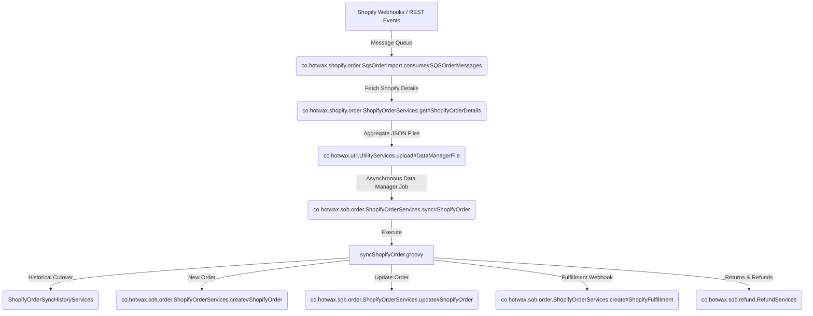

# Maarg OMS: Shopify Order Ingestion & Synchronization Lifecycle

This document provides a comprehensive, end-to-end technical overview of how orders are ingested from Shopify, transformed into OMS-compatible entities, synchronized (for changes, cancellations, returns, and refunds), and fulfilled within the Maarg OMS ecosystem.

---

## 1. High-Level Flow Architecture

The order synchronization system uses a decoupling pattern: SQS polls webhook/event messages, a staging layer groups order details into unified payloads via GraphQL, and the bridge sync engines ingest and update OMS core entities asynchronously.

---

## 2. Ingestion & Staging (SQS & GraphQL)

### A. Message Polling: `consume#SQSOrderMessages`
* **Source:** `SqsOrderImport.xml`
* **Trigger:** Chronologically scheduled polling of the SQS queue.
* **Process:**
  1. Polls a batch of order messages from SQS.
  2. Parses the message body JSON to extract the shop domain (`X-Shopify-Shop-Domain`).
  3. Resolves the corresponding `SystemMessageRemote` configuration by querying Moqui's `moqui.service.message.SystemMessageRemote` entity.
  4. Collects and groups Shopify Order IDs by their respective `systemMessageRemoteId`.
  5. Triggers `stage#ShopifyOrder` for the batch and deletes successfully polled messages from SQS.

### B. Payload Aggregation & Upload: `stage#ShopifyOrder`
* **Process:**
  1. Divides incoming Order IDs into:
     * **New Orders:** No record in `co.hotwax.shopify.ShopifyOrderHistory`.
     * **Updated Orders:** Order history record exists for the given `shopId` + `shopifyOrderId`.
  2. Iterates over order IDs and retrieves full, multi-relational details from Shopify via GraphQL using the `get#ShopifyOrderDetails` service (which performs a "Mega Query").
  3. Aggregates the retrieved order payloads into a unified JSON file (`ShopifyOrderList_*.json`).
  4. Uploads the aggregated JSON file to Moqui's Data Manager using the `upload#DataManagerFile` service, categorized by:
     * `SYNC_SHOPIFY_ORDER` (create orders = `true`)
     * `UPDATE_SHOPIFY_ORDER` (create orders = `false`)

---

## 3. Core Synchronization Orchestrator (`syncShopifyOrder.groovy`)

When the uploaded Data Manager files are processed, the system invokes `sync#ShopifyOrder`, executing the `syncShopifyOrder.groovy` script.

### Step 1: Historical Cut-Over Check
* Compares the order's `createdAt` timestamp against the cut-over threshold defined in `newOrderSync.launchDate` (System Property).
* If the order is older than the launch date and has no sync history, it is routed to `ShopifyOrderSyncHistoryServices` to archive pre-launch data, avoiding processing legacy orders as new.

### Step 2: Payload Segregation
* Analyzes order transactions, refunds, and return events.
* Identifies and extracts **Exchange Line Items** (if any are present under Shopify's returns).
* Filters out exchange-related line items from the main order payload to ensure they are processed separately through the refund/exchange flow.

### Step 3: Branching Execution (New vs. Existing)
* **New Orders (Case H):** If no entry exists in `ShopifyOrderHistory`, it invokes `create#ShopifyOrder`.
* **Existing Orders (Case I):** If an entry exists, it compares JSON hashes of major fields (`email`, `phone`, `note`, `tags`, `shippingAddress`, `billingAddress`, `customer`, `paymentTerms`, `totalOutstandingSet`) with historical values:
  * If a discrepancy is found, it aggregates changes and invokes `update#ShopifyOrder`.

### Step 4: Fulfillment Processing
* Checks the payload's `fulfillments` against `ShopifyFulfillmentHistory`.
* Invokes `create#ShopifyFulfillment` for any new/unprocessed fulfillments.

### Step 5: Returns, Refunds & Transactions Processing
* Evaluates returns and refunds sequentially:
  * Open returns generate progress states (`create#ShopifyInProgressReturn`).
  * Closed returns are resolved alongside refund transactions (`create#ShopifyCompletedReturn` / `process#ShopifyRefund`).
* Compares payment transactions and creates any missing `OrderPaymentPreference` entities.

---

## 4. Mapping & Transformation (`prepareTransformedShopifyOrderPayload.groovy`)

Before any order is created or updated in the OMS, the raw Shopify JSON must be translated into Moqui/OMS entities. This is handled by `prepare#TransformedShopifyOrderPayload`.

| Shopify Attribute | Transform Logic / Target Entity | Details |
| :--- | :--- | :--- |
| **Address** | Maps to `postalAddress` (`moqui.basic.Geo`) | Resolves countries (`GEOT_COUNTRY`) and states/provinces dynamically using ISO-2/ISO-3 code lookups. |
| **Location / Facility** | Maps to `facilityId` | Resolves Shopify's POS retail location using `ShopifyShopLocation` mapping. Standard ship orders default to the store's primary fulfillment facility. |
| **Customer** | Maps to `Party` / `Person` / `OrderRole` | If the customer ID (`SHOPIFY_CUST_ID`) is new, a person record is created with default roles (`CUSTOMER`, `PLACING_CUSTOMER`, `BILL_TO_CUSTOMER`, etc.). |
| **Line Items** | Bucketed into Ship Groups | Line items are separated into distinct ship group buckets (`OrderItemShipGroup`) grouped by `FacilityID \| ShipmentMethodType \| CarrierPartyID \| SplitType`. |
| **Preorder & Backorder** | Tags mapping | Evaluates catalog membership (`PCCT_PREORDR`, `PCCT_BACKORDER`) and Shopify product tags to apply `PreOrderItemProperty` or `BackOrderItemProperty` attributes. |
| **Discounts & Promotions** | Maps to `OrderAdjustment` | Translates discount application codes and amounts into `EXT_PROMO_ADJUSTMENT` adjustments. |
| **Taxes** | Maps to `SALES_TAX` adjustments | Maps tax titles and rates from Shopify's tax lines. |

---

## 5. Operations: Creation, Update, and Fulfillment

### A. Order Creation (`create#ShopifyOrder`)
1. Parses the transformed payload mapping.
2. Creates the sales order header and line items via `co.hotwax.oms.order.OrderServices.create#SalesOrder`.
3. Records the mapping relationship in the `co.hotwax.shopify.ShopifyShopOrder` entity.
4. Processes the order payment preferences using Shopify transactions.
5. Sets up `OrderTerm` values for outstanding terms if dynamic payment terms are configured.

### B. Order Updates (`update#ShopifyOrder`)
* **Customer updates:** Detects changes in person details (first/last names, primary emails) and updates existing party records.
* **Line Item Additions:** Resolves variant GIDs to OMS product IDs, determines fulfillment statuses, sets unit prices, and creates new `OrderItem` entries.
* **Address & Note Updates:** Modifies shipping addresses across all linked shipments/ship groups, updates internal notes (`OrderHeaderNote`), and re-synchronizes customer note attributes.

### C. Fulfillment Ingestion (`create#ShopifyFulfillment`)
Fulfillments imported from Shopify are applied as physical shipments or virtual issuance in the OMS:
1. Resolves Shopify's location ID to the OMS `facilityId` using `ShopifyShopLocation`.
2. Validates if the facility is a **Virtual Facility** vs. a **Physical Facility**.
3. For **Physical Facilities**:
   * For physical items, iterates over order line items and issues the items from inventory.
   * Generates `ItemIssuance` records.
   * Decrements inventory quantities by creating `InventoryItemDetail` records (setting negative `quantityOnHandDiff` and `availableToPromise` values).
4. Updates the item status to completed (`ITEM_COMPLETED`) via `change#OrderItemStatus`.
5. For pre-existing shipment headers: marks shipment statuses as shipped (`FulfillmentServices.ship#Shipment`) and links the Shopify fulfillment ID to the shipment's `externalId`.

---

## 6. Audit & State Entities

The bridge uses several tracking tables to ensure data integrity, trace changes, and enforce idempotency:

* **`co.hotwax.shopify.ShopifyShopOrder`**: Links `shopId` + `shopifyOrderId` directly to the OMS `orderId`.
* **`co.hotwax.shopify.ShopifyOrderHistory`**: Stores fields and JSON attribute hashes (`tagsHash`, `shippingAddressHash`, etc.) to quickly detect payload differentials.
* **`co.hotwax.shopify.ShopifyOrderItemHist`**: Tracks imported quantity and details for individual order lines.
* **`co.hotwax.shopify.ShopifyTransactionHistory`**: Logs payment gateway transactions to prevent duplicate settlement preferences.
* **`co.hotwax.shopify.ShopifyFulfillmentHistory`**: Records processed fulfillment IDs.
* **`co.hotwax.shopify.ShopifyReturnHistory`**: Audits returned, refunded, and exchanged line item sync states.
