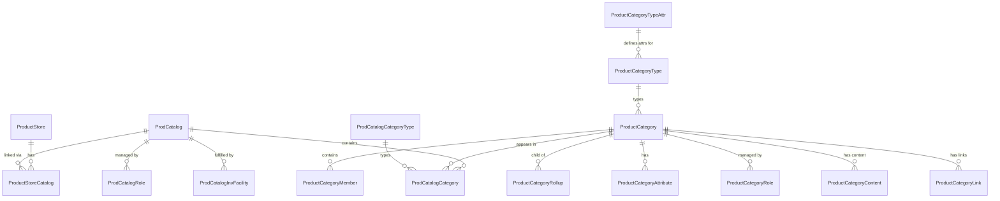

# 📦 OFBiz Product Data Model — Part 1: Catalog & Category Entities

> **Source**: OFBizDatamodelBook_Combined_20171001 & The Data Model Resource Book Vol. 1
> **Scope**: Product Catalog, Category, and all supporting entities

---

## 🗺️ Overview: How Catalog & Category Fit Together

```
ProductStore ──────────────── ProductStoreCatalog ──────────────── ProdCatalog
                                                                        │
                                                              ProdCatalogCategory
                                                                        │
                                                              ProductCategory ◄──── ProductCategoryType
                                                                        │
                                                         ProductCategoryMember
                                                                        │
                                                                    Product
```

The model follows a **top-down hierarchy**:
1. A **ProductStore** (e.g., your webstore) links to one or more **ProdCatalogs**
2. A **ProdCatalog** contains multiple **ProductCategories** via **ProdCatalogCategory**
3. Each **ProductCategory** holds **Products** via **ProductCategoryMember**
4. Categories can be hierarchically nested via **ProductCategoryRollup**

---

## 1. 🏪 `ProdCatalog` — Product Catalog

> **Purpose**: Top-level container for organizing products into browseable structures. Think of it as the "catalog" of an e-commerce website like Amazon's product catalog, IKEA's print catalog, etc.

| Field | Type | Key | Description |
|-------|------|-----|-------------|
| `prodCatalogId` | String | 🔑 PK | Unique identifier for this catalog (e.g., `DemoCatalog`, `B2BCatalog`) |
| `catalogName` | String | | Human-readable display name shown in UI (e.g., "Spring 2024 Collection") |
| `useQuickAdd` | Y/N | | Enables a "Quick Add" feature where users can rapidly add many products to cart from a simple list view — useful for B2B reorder flows |
| `styleSheet` | String | | Path/reference to a custom CSS stylesheet specific to this catalog — allows visual customization per catalog |
| `headerLogo` | String | | Path/URL to the logo image shown in the catalog header |
| `contentPathPrefix` | String | | Prefix path prepended to all content (image, PDF) URLs for this catalog — useful for CDN or environment-specific paths |
| `templatePathPrefix` | String | | Prefix path for FreeMarker/Groovy templates used to render catalog pages |
| `viewAllowPermReqd` | Y/N | | If `Y`, users need explicit permission to **view** this catalog (B2B gated catalogs, internal catalogs) |
| `purchaseAllowPermReqd` | Y/N | | If `Y`, users need explicit permission to **purchase** from this catalog — useful for wholesale-only or restricted catalogs |

**Relationships:**
- `ProdCatalogCategory` — links this catalog to its root categories
- `ProductStoreCatalog` — links this catalog to one or more product stores

---

## 2. 🔗 `ProductStoreCatalog` — Store-Catalog Link

> **Purpose**: A **join entity** that connects a **ProductStore** (e-commerce storefront) to a **ProdCatalog**. One store can have multiple catalogs; one catalog can be shared across stores.

| Field | Type | Key | Description |
|-------|------|-----|-------------|
| `prodCatalogId` | String | 🔑 PK + FK → ProdCatalog | Which catalog is being linked |
| `productStoreId` | String | 🔑 PK + FK → ProductStore | Which store this catalog is attached to |
| `fromDate` | DateTime | 🔑 PK | Effective start date — when this store-catalog association becomes active |
| `thruDate` | DateTime | | Effective end date — when this association expires (null = still active) |
| `sequenceNum` | Integer | | Display order when a store has multiple catalogs — lower numbers appear first |

**Key Concept — Effective Dates:**
> OFBiz uses `fromDate`/`thruDate` patterns throughout the data model instead of delete operations. This gives you a **full audit history** — you can see which catalog was attached to which store at any point in time.

---

## 3. 📁 `ProductCategory` — Product Category

> **Purpose**: Represents a category or grouping of products. Categories can be nested (hierarchical tree) and typed. Examples: "Electronics > Laptops > Gaming Laptops"

| Field | Type | Key | Description |
|-------|------|-----|-------------|
| `productCategoryId` | String | 🔑 PK | Unique identifier (e.g., `ELECTRONICS`, `LAPTOPS`, `GAMING_LAPTOPS`) |
| `productCategoryTypeId` | String | FK → ProductCategoryType | The **type** of this category — controls behavior (see type table below) |
| `primaryParentCategoryId` | String | FK → ProductCategory | Self-reference to this category's **primary parent** in the hierarchy — the main parent when a category could have multiple parents |
| `categoryName` | String | | Display name of the category (e.g., "Gaming Laptops") |
| `description` | String | | Short text description used in category listings |
| `longDescription` | String | | Full HTML-capable description — used on the category landing page |
| `categoryImageUrl` | String | | URL to the category's banner or thumbnail image |
| `linkOneImageUrl` | String | | Primary promotional image link — used for featured/hero banners |
| `linkTwoImageUrl` | String | | Secondary promotional image link |
| `detailScreen` | String | | Reference to a custom FTL/screen layout for this category's detail page — overrides default template |
| `showInSelect` | Y/N | | Whether to show this category in dropdown/select menus (e.g., category filter dropdowns) |

**Important Design Pattern:**
> `primaryParentCategoryId` gives the "main" parent. However, a category can belong to **multiple parent categories** via `ProductCategoryRollup` — enabling cross-listing (e.g., "Gaming Laptops" appearing under both "Gaming" and "Laptops").

---

## 4. 🏷️ `ProductCategoryType` — Category Type Definitions

> **Purpose**: Defines the *kind* of category — controls how OFBiz treats and processes it.

| Field | Type | Key | Description |
|-------|------|-----|-------------|
| `productCategoryTypeId` | String | 🔑 PK | Unique type code |
| `parentTypeId` | String | FK → ProductCategoryType | Parent type (enables type inheritance hierarchy) |
| `hasTable` | Y/N | | If `Y`, there is an additional detail table for this type |
| `description` | String | | Human-readable description of the type |

**Common Built-in Category Types:**

| Type ID | Description |
|---------|-------------|
| `CATALOG_CATEGORY` | Standard browseable catalog category |
| `CROSS_SELL_CATEGORY` | Products shown as cross-sell recommendations |
| `UP_SELL_CATEGORY` | Products shown as upsell recommendations |
| `TAX_CATEGORY` | Category used to apply tax rules to products |
| `SEARCH_CATEGORY` | Category used for search results organization |
| `PROMOTIONS_CATEGORY` | Category holding promotional/discounted products |
| `QUICKADD_CATEGORY` | Category displayed in the quick-add grid |
| `VIEW_ALLOW_CATEGORY` | Category access-controlled for viewing |
| `PURCHASE_ALLOW_CATEGORY` | Category access-controlled for purchasing |

---

## 5. 🗂️ `ProdCatalogCategory` — Catalog-to-Category Mapping

> **Purpose**: Maps a `ProductCategory` into a `ProdCatalog` at a specific **role** (e.g., Browse Root, Promotions, Quick Add). This join entity defines *how* a category appears within a catalog.

| Field | Type | Key | Description |
|-------|------|-----|-------------|
| `prodCatalogId` | String | 🔑 PK + FK → ProdCatalog | The parent catalog |
| `productCategoryId` | String | 🔑 PK + FK → ProductCategory | The category being attached |
| `prodCatalogCategoryTypeId` | String | 🔑 PK + FK → ProdCatalogCategoryType | **The role/purpose** of this category within the catalog (see types below) |
| `fromDate` | DateTime | 🔑 PK | When this mapping becomes effective |
| `thruDate` | DateTime | | When this mapping expires |
| `sequenceNum` | Integer | | Sort order — controls the display sequence of this category within the catalog |

**Why `prodCatalogCategoryTypeId` Matters:**
The same category can be attached to the same catalog multiple times with different type IDs. For example, "Featured Products" category could be both the `PCCT_BROWSE_ROOT` (main navigation root) and `PCCT_PROMOTIONS` (promotions display area).

---

## 6. 🏷️ `ProdCatalogCategoryType` — Catalog Category Type

> **Purpose**: Defines the **role** that a ProductCategory plays within a ProdCatalog.

| Field | Type | Key | Description |
|-------|------|-----|-------------|
| `prodCatalogCategoryTypeId` | String | 🔑 PK | Unique type identifier |
| `description` | String | | Description of this category role |

**Built-in Types:**

| Type ID | Description |
|---------|-------------|
| `PCCT_BROWSE_ROOT` | **Browse Root** — Top-level navigation root category for the catalog's browse tree |
| `PCCT_PROMOTIONS` | **Promotions** — Category shown in the promotions section |
| `PCCT_QUICK_ADD` | **Quick Add** — Category shown in the Quick Add grid for B2B reorders |
| `PCCT_ADMIN_ALLW` | **Admin Allow** — Category that admins are permitted to manage |
| `PCCT_PURCH_ALLW` | **Purchase Allow** — Category that logged-in users can purchase from |
| `PCCT_VIEW_ALLW` | **View Allow** — Category that logged-in users can view |
| `PCCT_MOST_POPULAR` | **Most Popular** — Category showing most-ordered products |
| `PCCT_SEARCH` | **Search** — Category used for search-based display |

---

## 7. 📋 `ProductCategoryMember` — Product in a Category

> **Purpose**: The **join entity** that places a `Product` into a `ProductCategory`. Also time-bounded — meaning a product can be in a category for a specific date range only.

| Field | Type | Key | Description |
|-------|------|-----|-------------|
| `productCategoryId` | String | 🔑 PK + FK → ProductCategory | The category the product belongs to |
| `productId` | String | 🔑 PK + FK → Product | The product being categorized |
| `fromDate` | DateTime | 🔑 PK | When this product joins the category (membership start) |
| `thruDate` | DateTime | | When this product leaves the category (membership end — null means currently active) |
| `comments` | String | | Optional notes about why the product is in this category |
| `sequenceNum` | Integer | | Display order of this product within the category listing — lower = appears first |
| `quantity` | Decimal | | Default quantity — used in marketing packages or bundle categories where a specific quantity of this product is included |

**Use Cases:**
- Seasonal promotions: product is in "Summer Sale" category only from `2024-06-01` to `2024-08-31`
- Bundle categories: `quantity = 3` means "this category includes 3 of this product"
- Sequenced featured products: `sequenceNum = 1` puts this product first in the featured grid

---

## 8. 🌲 `ProductCategoryRollup` — Category Hierarchy

> **Purpose**: Defines **parent-child relationships** between categories. Unlike `primaryParentCategoryId` on `ProductCategory` (which is a single primary parent), `ProductCategoryRollup` allows a category to have **multiple parents** — enabling cross-category browsing.

| Field | Type | Key | Description |
|-------|------|-----|-------------|
| `productCategoryId` | String | 🔑 PK + FK → ProductCategory | The **child** category |
| `parentProductCategoryId` | String | 🔑 PK + FK → ProductCategory | The **parent** category |
| `fromDate` | DateTime | 🔑 PK | When this parent-child link becomes active |
| `thruDate` | DateTime | | When this link expires |
| `sequenceNum` | Integer | | Order of child categories under this parent |

**Example:**
```
Electronics (parent)
  └── Gaming Laptops (child via ProductCategoryRollup)
Computers (parent)
  └── Gaming Laptops (child via ProductCategoryRollup — same category, different parent!)
```

---

## 9. 🔑 `ProductCategoryAttribute` — Custom Category Attributes

> **Purpose**: Stores dynamic, **key-value pair attributes** for categories that don't fit the standard schema fields. Extensible without schema changes.

| Field | Type | Key | Description |
|-------|------|-----|-------------|
| `productCategoryId` | String | 🔑 PK + FK | The category this attribute belongs to |
| `attrName` | String | 🔑 PK | Attribute name/key (e.g., `season`, `featured_banner_color`, `min_age`) |
| `attrValue` | String | | The attribute value (e.g., `summer`, `#FF5733`, `18`) |
| `attrDescription` | String | | Human-readable description explaining what this attribute means |

---

## 10. 👥 `ProductCategoryRole` — Party Roles for Categories

> **Purpose**: Associates parties (people, organizations) with a product category in a specific **role**. Used for ownership, management, and content authorship of categories.

| Field | Type | Key | Description |
|-------|------|-----|-------------|
| `productCategoryId` | String | 🔑 PK + FK | The category |
| `partyId` | String | 🔑 PK + FK → Party | The person or organization |
| `roleTypeId` | String | 🔑 PK + FK → RoleType | The role they play (e.g., `OWNER`, `CONTENT_ADMIN`, `BUYER`) |
| `fromDate` | DateTime | 🔑 PK | Role start date |
| `thruDate` | DateTime | | Role end date |
| `comments` | String | | Notes about this party-category relationship |

---

## 11. 🖼️ `ProductCategoryContent` — Content Linked to Categories

> **Purpose**: Associates `Content` records (images, descriptions, documents) with a `ProductCategory`. Enables content management without hardcoding URLs in the category entity.

| Field | Type | Key | Description |
|-------|------|-----|-------------|
| `productCategoryId` | String | 🔑 PK + FK | The category |
| `contentId` | String | 🔑 PK + FK → Content | The content record (image, text, document) |
| `prodCatContentTypeId` | String | 🔑 PK + FK | What type of content this is (see below) |
| `fromDate` | DateTime | 🔑 PK | When this content is active |
| `thruDate` | DateTime | | When this content expires |

**Common Content Types (`prodCatContentTypeId`):**

| Type | Description |
|------|-------------|
| `CATEGORY_IMAGE_URL` | Category hero/banner image |
| `CATEGORY_IMAGE_ALT` | Alt text for the category image (accessibility) |
| `CATEGORY_DESCRIPTION` | Rich HTML description content |
| `CATEGORY_NAME` | Localized name content |
| `LINK_ONE_IMAGE_URL` | Primary promotional link image |
| `LINK_TWO_IMAGE_URL` | Secondary promotional link image |

---

## 12. 🔗 `ProductCategoryLink` — Navigation Links for Categories

> **Purpose**: Defines clickable navigation links or promotional banners associated with a category. Think of featured banners or sidebar links on a category page.

| Field | Type | Key | Description |
|-------|------|-----|-------------|
| `productCategoryId` | String | 🔑 PK + FK | The category |
| `linkSeqId` | String | 🔑 PK | Sequence ID to uniquely identify this link |
| `fromDate` | DateTime | 🔑 PK | When this link is active |
| `thruDate` | DateTime | | When this link expires |
| `comments` | String | | Notes about this link |
| `sequenceNum` | Integer | | Display order of this link |
| `titleText` | String | | Clickable link title/label |
| `detailText` | String | | Descriptive text shown below/near the link |
| `imageUrl` | String | | Primary image URL for this link (banner image) |
| `imageTwoUrl` | String | | Secondary image URL |
| `linkTypeEnumId` | String | FK → Enumeration | Link type (e.g., `CAT_LINK_ANCHOR`, `CAT_LINK_POPUP`) |
| `linkInfo` | String | | Destination URL or routing info for the link |
| `detailSubScreen` | String | | Reference to a specific sub-screen template for rendering this link |

---

## 13. 🔗 `ProdCatalogRole` — Party Roles for Catalogs

> **Purpose**: Associates parties (people, orgs) with a `ProdCatalog` in a specific role. Controls who manages or has access to a catalog.

| Field | Type | Key | Description |
|-------|------|-----|-------------|
| `partyId` | String | 🔑 PK + FK → Party | The party involved |
| `roleTypeId` | String | 🔑 PK + FK → RoleType | Their role (e.g., `CATALOG_MANAGER`) |
| `prodCatalogId` | String | 🔑 PK + FK → ProdCatalog | The catalog |
| `fromDate` | DateTime | 🔑 PK | Role start date |
| `thruDate` | DateTime | | Role end date |
| `sequenceNum` | Integer | | Ordering field |

---

## 14. 🏭 `ProdCatalogInvFacility` — Catalog Inventory Facility

> **Purpose**: Links a `ProdCatalog` to `Facility` (warehouse/store) records. Defines which inventory facilities (warehouses) fulfill orders placed through this catalog.

| Field | Type | Key | Description |
|-------|------|-----|-------------|
| `prodCatalogId` | String | 🔑 PK + FK | The catalog |
| `facilityId` | String | 🔑 PK + FK → Facility | The warehouse/facility |
| `fromDate` | DateTime | 🔑 PK | When this facility link is active |
| `thruDate` | DateTime | | When this link expires |
| `sequenceNum` | Integer | | Priority order — lower = higher priority for inventory sourcing |

---

## 15. 🏷️ `ProductCategoryTypeAttr` — Attribute Definitions per Category Type

> **Purpose**: Defines which **custom attributes** are valid/expected for a given `ProductCategoryType`. Used as a metadata schema for `ProductCategoryAttribute`.

| Field | Type | Key | Description |
|-------|------|-----|-------------|
| `productCategoryTypeId` | String | 🔑 PK + FK → ProductCategoryType | The category type this attribute applies to |
| `attrName` | String | 🔑 PK | The attribute name that's valid for this category type |

---

## 🔄 Entity Relationship Summary



---

## 📝 Key Design Principles from the OFBiz Data Model

> [!NOTE]
> **Effective Dates Pattern**: Nearly every join/relationship entity uses `fromDate` (PK) + `thruDate` instead of hard deletes. This gives complete historical audit trails.

> [!TIP]
> **Type Entities Pattern**: `ProductCategoryType`, `ProdCatalogCategoryType` follow the standard OFBiz "Type" pattern — they have `parentTypeId` for hierarchical type inheritance and `hasTable` for extensibility.

> [!IMPORTANT]
> **Multiple Catalog Hierarchies**: A `ProductCategory` can be in multiple catalogs (via `ProdCatalogCategory`) AND have multiple parents (via `ProductCategoryRollup`). This enables sophisticated multi-catalog and cross-category browsing without data duplication.

> [!NOTE]
> **Permission Control**: Both `ProdCatalog` (`viewAllowPermReqd`, `purchaseAllowPermReqd`) and `ProdCatalogCategoryType` (`PCCT_VIEW_ALLW`, `PCCT_PURCH_ALLW`) provide layered access control — useful for B2B portals, internal procurement systems, and tiered customer access.

---

*⏸️ Pausing here as requested. Ready for Part 2: Feature Entities, Product Price, Promo, Cost, and Detail Product Entities when you give the instruction.*
