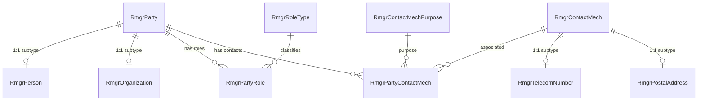

# Relationship Manager Plugin — File Guide

All custom/modified files live under:
```
plugins/relationshipmgr/
```

---

## 1. Component Registration

### [`ofbiz-component.xml`](file:///home/harshmahajan/Sandbox/ofbiz-framework/plugins/relationshipmgr/ofbiz-component.xml)

**Role:** The "bootstrap" file. OFBiz reads this at startup to discover the entire plugin.

| What it registers | Line(s) | Purpose |
|---|---|---|
| Entity model | 30 | Tells OFBiz to load `entitydef/entitymodel.xml` |
| Seed data | 32–33 | Loads `RelationshipmgrTypeData.xml` and security permission seed data |
| Demo data | 34–35 | Loads security group demo data and `RelationshipmgrDemoData.xml` |
| Service definitions | 38 | Loads `servicedef/services.xml` |
| Webapp mount | 47–52 | Mounts the webapp at `/relationshipmgr`, requires `OFBTOOLS` or `RELATIONSHIPMGR` permission |

---

## 2. Entity / Data Model Layer

### [`entitydef/entitymodel.xml`](file:///home/harshmahajan/Sandbox/ofbiz-framework/plugins/relationshipmgr/entitydef/entitymodel.xml)

**Role:** Defines the **entire relational data model** (10 custom entities). This is the database schema.

| Entity | Type | Purpose |
|---|---|---|
| `RmgrParty` | **Supertype** | The root party table. Every person or organization starts here. Has `partyId` (PK) + `partyTypeId` (PERSON / ORGANIZATION). |
| `RmgrPerson` | **Subtype** of Party | Stores person-specific fields: `firstName`, `lastName`, `birthDate`. FK → `RmgrParty`. |
| `RmgrOrganization` | **Subtype** of Party | Stores org-specific field: `organizationName`. FK → `RmgrParty`. |
| `RmgrRoleType` | **Classification** | Lookup table for role types (Student, Teacher, Customer, etc.). |
| `RmgrPartyRole` | **Intersection/Association** | Links a party to one or more roles. Composite PK: (`partyId`, `roleTypeId`). |
| `RmgrContactMech` | **Supertype** | Root contact mechanism. Has `contactMechId` + `contactMechTypeEnumId` (TELECOM_NUMBER / EMAIL_ADDRESS / POSTAL_ADDRESS). |
| `RmgrTelecomNumber` | **Subtype** of ContactMech | Phone details: `countryCode`, `areaCode`, `contactNumber`. FK → `RmgrContactMech`. |
| `RmgrPostalAddress` | **Subtype** of ContactMech | Address details: `toName`, `address1`, `address2`, `city`, `postalCode`. FK → `RmgrContactMech`. |
| `RmgrContactMechPurpose` | **Classification** | Lookup table for purposes (Home, Work, Office, Billing, Shipping). |
| `RmgrPartyContactMech` | **Intersection/Association** | Links a party to a contact mechanism with purpose and date range. Composite PK: (`partyId`, `contactMechId`, `contactMechPurposeId`, `fromDate`). |



---

## 3. Service Layer

### [`servicedef/services.xml`](file:///home/harshmahajan/Sandbox/ofbiz-framework/plugins/relationshipmgr/servicedef/services.xml)

**Role:** Declares all services (both auto-generated CRUD and custom composite). OFBiz's service engine reads this.

**Part A — Entity-Auto Services** (lines 9–46): Simple single-table CRUD wrappers auto-generated by OFBiz for each entity:
- `createRmgrParty`, `createRmgrPerson`, `createRmgrOrganization`, `createRmgrPartyRole`, `createRmgrContactMech`, `createRmgrTelecomNumber`, `createRmgrPostalAddress`, `createRmgrPartyContactMech`

**Part B — Custom Composite Groovy Services** (lines 49–94): Multi-step business logic:

| Service | What it does |
|---|---|
| `createPersonWithParty` | Creates `RmgrParty` (type=PERSON) → `RmgrPerson` → `RmgrPartyRole` in one transaction |
| `createOrganizationWithParty` | Creates `RmgrParty` (type=ORGANIZATION) → `RmgrOrganization` → `RmgrPartyRole` |
| `createTelecomNumberWithContact` | Creates `RmgrContactMech` → `RmgrTelecomNumber` → `RmgrPartyContactMech` |
| `createPostalAddressWithContact` | Creates `RmgrContactMech` → `RmgrPostalAddress` → `RmgrPartyContactMech` |
| `createEmailWithContact` | Creates `RmgrContactMech` (with `infoString`) → `RmgrPartyContactMech` |

### [`groovyScripts/RelationshipServices.groovy`](file:///home/harshmahajan/Sandbox/ofbiz-framework/plugins/relationshipmgr/groovyScripts/RelationshipServices.groovy)

**Role:** The **business logic implementation** for all 5 composite services above.

Each method:
1. Auto-generates an ID via `delegator.getNextSeqId()` if not provided
2. Creates the supertype record
3. Creates the subtype record
4. Creates the association/intersection record
5. Returns the generated ID

---

## 4. Web / Controller Layer

### [`webapp/relationshipmgr/WEB-INF/controller.xml`](file:///home/harshmahajan/Sandbox/ofbiz-framework/plugins/relationshipmgr/webapp/relationshipmgr/WEB-INF/controller.xml)

**Role:** The **front controller** — maps URL requests to views and service invocations.

**Request Mappings:**

| URI | Type | Target |
|---|---|---|
| `main` | Navigation | Shows the main party list screen |
| `AddPersonScreen` | Navigation | Shows the Add Person form |
| `AddOrganizationScreen` | Navigation | Shows the Add Organization form |
| `viewPartyDetails` | Navigation | Shows party detail page |
| `createPerson` | Service event | Invokes `createPersonWithParty` → redirects to `viewPartyDetails` |
| `createOrganization` | Service event | Invokes `createOrganizationWithParty` → redirects to `viewPartyDetails` |
| `createTelecom` | Service event | Invokes `createTelecomNumberWithContact` → redirects to `viewPartyDetails` |
| `createPostal` | Service event | Invokes `createPostalAddressWithContact` → redirects to `viewPartyDetails` |
| `createEmail` | Service event | Invokes `createEmailWithContact` → redirects to `viewPartyDetails` |

**View Mappings** (lines 76–79): Map view names to screen XML definitions.

### [`webapp/relationshipmgr/WEB-INF/web.xml`](file:///home/harshmahajan/Sandbox/ofbiz-framework/plugins/relationshipmgr/webapp/relationshipmgr/WEB-INF/web.xml)

**Role:** Standard Java Servlet deployment descriptor. Sets the site name (`relationshipmgrSite`), local dispatcher name, and points the `mainDecoratorLocation` to `CommonScreens.xml`. **Mostly boilerplate**, not heavily customized.

---

## 5. UI / Widget Layer

### [`widget/CommonScreens.xml`](file:///home/harshmahajan/Sandbox/ofbiz-framework/plugins/relationshipmgr/widget/CommonScreens.xml)

**Role:** Defines the **page layout decorators** used by all screens.

- **`main-decorator`** (line 24): Sets up the app name, company name/subtitle, and tells OFBiz which menu to use as the nav bar (`MainAppBar` from `RelationshipmgrMenus.xml`). Includes the `GlobalDecorator` from the common module.
- **`RelationshipmgrCommonDecorator`** (line 51): Wraps all page content with a permission check (`RELATIONSHIPMGR_VIEW`). All screens use this as their decorator.

### [`widget/RelationshipmgrMenus.xml`](file:///home/harshmahajan/Sandbox/ofbiz-framework/plugins/relationshipmgr/widget/RelationshipmgrMenus.xml)

**Role:** Defines the **application navigation bar**. Currently extends `CommonAppBarMenu` but has **no menu items defined**, so the nav bar inherits whatever the parent provides.

> [!NOTE]
> This is where you would add tab items (e.g. "Parties", "Add Person", "Add Organization") to the application nav bar.

### [`widget/RelationshipmgrScreens.xml`](file:///home/harshmahajan/Sandbox/ofbiz-framework/plugins/relationshipmgr/widget/RelationshipmgrScreens.xml)

**Role:** Defines the **4 application screens**:

| Screen | Purpose |
|---|---|
| `main` | Homepage — shows search form (`FindParties`), list form (`ListParties`), and buttons to Add Person / Add Organization |
| `AddPersonScreen` | Displays the `AddPerson` form |
| `AddOrganizationScreen` | Displays the `AddOrganization` form |
| `viewPartyDetails` | Runs `ViewPartyDetails.groovy` to load data, then renders `ViewPartyDetails.ftl` |

### [`widget/RelationshipmgrForms.xml`](file:///home/harshmahajan/Sandbox/ofbiz-framework/plugins/relationshipmgr/widget/RelationshipmgrForms.xml)

**Role:** Defines **7 OFBiz widget forms**:

| Form | Type | Purpose |
|---|---|---|
| `FindParties` | single | Search form with Party ID text-find and Party Type dropdown |
| `ListParties` | list | Results table — uses `performFind` on `RmgrParty`, links each row to `viewPartyDetails` |
| `AddPerson` | single | Input form: Party ID (optional), First Name, Last Name, Birth Date, Role Type dropdown (from `RmgrRoleType`) |
| `AddOrganization` | single | Input form: Party ID (optional), Organization Name, Role Type dropdown |
| `AddTelecom` | single | Phone number form with purpose dropdown, country code, area code, contact number |
| `AddPostalAddress` | single | Postal address form with purpose, toName, attnName, address1/2, city, postal code |
| `AddEmail` | single | Email form with purpose and email address |

---

## 6. View / Template Layer

### [`webapp/relationshipmgr/ViewPartyDetails.ftl`](file:///home/harshmahajan/Sandbox/ofbiz-framework/plugins/relationshipmgr/webapp/relationshipmgr/ViewPartyDetails.ftl)

**Role:** The **FreeMarker template** that renders the party detail page. This is the most complex UI piece.

**Sections:**
1. **Header Summary** — Shows party info (Person name + birth date, or Organization name), plus Party ID and Type
2. **Assigned Roles** — Table listing all `RmgrPartyRole` records
3. **Contact Mechanisms Table** — Lists all associated contacts with type-specific rendering (email as mailto link, phone formatted with codes, postal address multi-line)
4. **Quick Add Forms** — Three side-by-side panels for adding Phone, Email, and Postal Address directly from the detail page

### [`webapp/relationshipmgr/WEB-INF/actions/ViewPartyDetails.groovy`](file:///home/harshmahajan/Sandbox/ofbiz-framework/plugins/relationshipmgr/webapp/relationshipmgr/WEB-INF/actions/ViewPartyDetails.groovy)

**Role:** The **screen action script** that loads all data before rendering `ViewPartyDetails.ftl`.

It populates the context with:
- `party` — the `RmgrParty` record
- `person` or `organization` — the subtype record (based on `partyTypeId`)
- `partyRoles` — list of `RmgrPartyRole` records
- `contactMechList` — enriched list of contact mechanisms with nested `telecom` / `postal` details

---

## 7. Configuration

### [`config/RelationshipmgrUiLabels.xml`](file:///home/harshmahajan/Sandbox/ofbiz-framework/plugins/relationshipmgr/config/RelationshipmgrUiLabels.xml)

**Role:** **Internationalization (i18n) labels** used throughout the UI.

| Key | Value |
|---|---|
| `RelationshipmgrApplication` | "Relationship Manager" |
| `RelationshipmgrCompanyName` | "OFBiz: Relationshipmgr" |
| `RelationshipmgrCompanySubtitle` | "Part of the Apache OFBiz Family..." |
| `RelationshipmgrViewPermissionError` | "You are not allowed to view this page." |
| `RelationshipmgrAddPerson` | "Add Person" |
| `RelationshipmgrAddOrganization` | "Add Organization" |
| `RelationshipmgrPartyDetails` | "Party Contact Details" |

---

## 8. Seed & Demo Data

### [`data/RelationshipmgrTypeData.xml`](file:///home/harshmahajan/Sandbox/ofbiz-framework/plugins/relationshipmgr/data/RelationshipmgrTypeData.xml)

**Role:** **Seed data** loaded on every install. Populates lookup tables:
- **8 Role Types:** Customer, Supplier, Employee, Employer, College, Department, Student, Teacher
- **5 Contact Mech Purposes:** Home, Work, Office, Billing Location, Shipping Location

### [`data/RelationshipmgrDemoData.xml`](file:///home/harshmahajan/Sandbox/ofbiz-framework/plugins/relationshipmgr/data/RelationshipmgrDemoData.xml)

**Role:** **Demo data** for testing. Pre-populates the system with a college scenario:
- 2 organizations (St. Stephens College, CS Department)
- 3 persons (2 students, 1 teacher)
- 5 party-role assignments
- 5 contact mechanisms (addresses, phones, emails) with party associations

---

## 9. Security

### [`data/RelationshipmgrSecurityPermissionSeedData.xml`](file:///home/harshmahajan/Sandbox/ofbiz-framework/plugins/relationshipmgr/data/RelationshipmgrSecurityPermissionSeedData.xml)

**Role:** Creates the **5 security permissions**: `RELATIONSHIPMGR_VIEW`, `_CREATE`, `_UPDATE`, `_DELETE`, `_ADMIN`. Grants `_ADMIN` to the `SUPER` security group.

### [`data/RelationshipmgrSecurityGroupDemoData.xml`](file:///home/harshmahajan/Sandbox/ofbiz-framework/plugins/relationshipmgr/data/RelationshipmgrSecurityGroupDemoData.xml)

**Role:** Grants permissions to demo security groups: `FULLADMIN` gets `_ADMIN`, `FLEXADMIN` gets all 4 CRUD permissions, `VIEWADMIN` gets `_VIEW`, `BIZADMIN` gets `_ADMIN`.

---

## Summary: Complete File Tree

```
plugins/relationshipmgr/
├── ofbiz-component.xml              ← Component registration (bootstrap)
├── entitydef/
│   └── entitymodel.xml              ← 10 custom entities (data model)
├── servicedef/
│   └── services.xml                 ← 8 entity-auto + 5 composite services
├── groovyScripts/
│   └── RelationshipServices.groovy  ← Business logic (5 composite methods)
├── webapp/relationshipmgr/
│   ├── ViewPartyDetails.ftl         ← Party detail FreeMarker template
│   └── WEB-INF/
│       ├── controller.xml           ← URL routing (9 requests, 4 views)
│       ├── web.xml                  ← Servlet config (boilerplate)
│       └── actions/
│           └── ViewPartyDetails.groovy  ← Data loading for detail page
├── widget/
│   ├── CommonScreens.xml            ← Page decorators / layout
│   ├── RelationshipmgrMenus.xml     ← Nav bar menu definition
│   ├── RelationshipmgrScreens.xml   ← 4 screen definitions
│   └── RelationshipmgrForms.xml     ← 7 form definitions
├── config/
│   └── RelationshipmgrUiLabels.xml  ← i18n labels
└── data/
    ├── RelationshipmgrTypeData.xml              ← Seed: role types + purposes
    ├── RelationshipmgrDemoData.xml              ← Demo: sample college data
    ├── RelationshipmgrSecurityPermissionSeedData.xml  ← Seed: permissions
    └── RelationshipmgrSecurityGroupDemoData.xml       ← Demo: group→permission
```
