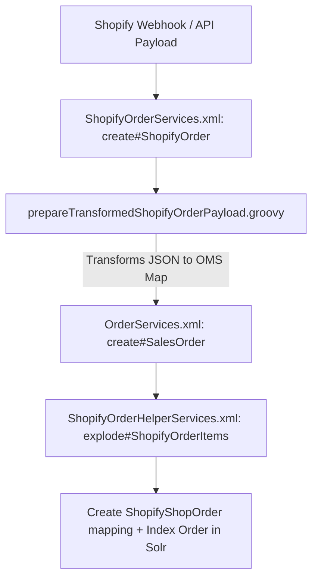

# Codebase Learning Plan: `shopify-oms-bridge`

This document details the learning path and curriculum to help you master the architecture and logic of the `shopify-oms-bridge` component. We will break this down into **5 modules**, moving from the high-level architecture to line-by-line flow walks, followed by hands-on tracing exercises.

---

## 🗺️ Module 1: The Blueprint & Folder Structure (Overview)
**Objective**: Understand what a Moqui component is and where each type of file belongs.

* **Key Concepts**:
  * **What is it?** `shopify-oms-bridge` acts as the middleman between Shopify APIs and the Hotwax Order Management System (OMS).
  * **Component Declaration**: [component.xml](file:///home/harshmahajan/Sandbox/maarg/runtime/component/shopify-oms-bridge/component.xml) defines dependencies (like `mantle-udm` and `shopify-connector`).
  * **Internal Configurations**: [MoquiConf.xml](file:///home/harshmahajan/Sandbox/maarg/runtime/component/shopify-oms-bridge/MoquiConf.xml) overrides global settings for this component.

* **The Directory Layout**:
  | Directory | Purpose | Key Files to Note |
  | :--- | :--- | :--- |
  | `entity/` | Database table definitions (UDM overrides / extensions) | [OrderSyncEntities.xml](file:///home/harshmahajan/Sandbox/maarg/runtime/component/shopify-oms-bridge/entity/OrderSyncEntities.xml) |
  | `service/` | Business logic declarations (Inputs/Outputs, Rest APIs, SECAs) | `shopify.rest.xml`, `shopify_sync.secas.xml` |
  | `script/` | Dynamic execution scripts (primarily Groovy) | `prepareTransformedShopifyOrderPayload.groovy` |
  | `screen/` | User Interface templates & views | Admin screens |
  | `data/` | Seed & setup XML data loaded into the database | XML datasets |

---

## 🗄️ Module 2: The Core Data Model (Entities)
**Objective**: Learn how connection metadata and sync states are persisted.

We will study how Moqui maps database records using the following files:
1. **System Message Remote (`SystemMessageRemote` / SMR)**:
   * How Shopify credentials (API Access Tokens, Shop Domain, Client Secrets for webhooks) are saved and queried dynamically.
2. **Order Sync & Mapping Definitions**:
   * [OrderSyncEntities.xml](file:///home/harshmahajan/Sandbox/maarg/runtime/component/shopify-oms-bridge/entity/OrderSyncEntities.xml)
   * Exploring key mapping tables like `ShopifyShopOrder`, `ShopifyShopProduct`, and custom sync statuses.

---

## 🔄 Module 3: Webhooks & API Architecture (REST & SECAs)
**Objective**: Trace how incoming events from Shopify or internal events in Moqui trigger bridging actions.

We will analyze:
1. **REST Endpoints**:
   * How REST endpoints map to Moqui services using [shopify.rest.xml](file:///home/harshmahajan/Sandbox/maarg/runtime/component/shopify-oms-bridge/service/shopify.rest.xml) and [sob.rest.xml](file:///home/harshmahajan/Sandbox/maarg/runtime/component/shopify-oms-bridge/service/sob.rest.xml).
2. **Event-Driven Actions (SECAs)**:
   * [shopify_sync.secas.xml](file:///home/harshmahajan/Sandbox/maarg/runtime/component/shopify-oms-bridge/service/shopify_sync.secas.xml).
   * How a change in order status, fulfillment, or stock in the OMS triggers an automatic synchronization event to push the update back to Shopify.

---

## 📥 Module 4: Deep Dive into the Order Import Flow
**Objective**: Perform a line-by-line structural walkthrough of how a Shopify Order is imported and mapped.

This is the most critical pipeline in the component. We will trace it step-by-step:

* **Files we will read together**:
  1. [ShopifyOrderServices.xml](file:///home/harshmahajan/Sandbox/maarg/runtime/component/shopify-oms-bridge/service/co/hotwax/sob/order/ShopifyOrderServices.xml) — The orchestration entry point.
  2. [prepareTransformedShopifyOrderPayload.groovy](file:///home/harshmahajan/Sandbox/maarg/runtime/component/shopify-oms-bridge/script/co/hotwax/sob/order/prepareTransformedShopifyOrderPayload.groovy) — The complex data mapping script converting Shopify JSON to OMS formats.
  3. [ShopifyOrderHelperServices.xml](file:///home/harshmahajan/Sandbox/maarg/runtime/component/shopify-oms-bridge/service/co/hotwax/sob/order/ShopifyOrderHelperServices.xml) — Exploding order quantities and applying adjustments/prorations.

---

## 🧪 Module 5: Practical Exercises & Verification
**Objective**: Test your knowledge with simulated tasks.

1. **"Find the File" Challenges**:
   * E.g., *"Where does the system verify the Shopify Webhook HMAC signature?"*
2. **Log Tracking**:
   * How to watch the logs to debug a failed order import.
3. **Database Inspection**:
   * Finding mapping records (e.g. `ShopifyShopProduct`) to ensure product identifier matching is working correctly.

---

> [!TIP]
> **Suggested Approach**: We will tackle one module at a time. I will explain the file paths and patterns, and then we will look at code files together to discuss the *why* and the *how*. 
>
> Let me know if this plan works for you or if you'd like to adjust any details before we begin Module 1!
